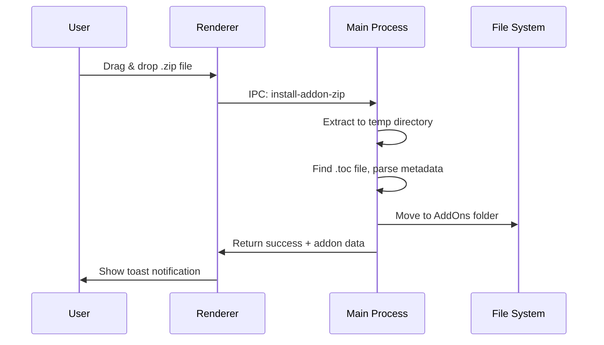
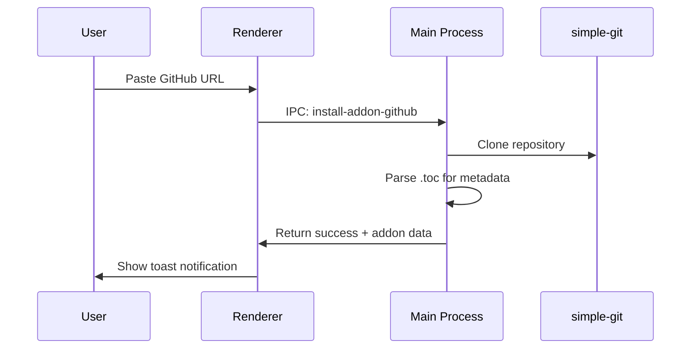

# Addon Management

Core functionality for managing World of Warcraft addons.

---

## Purpose

Enable users to install, organize, update, and remove WoW addons across multiple game installations with minimal friction.

---

## Business Rules

1. Each addon lives in a folder under `Interface/AddOns/` in the WoW directory
2. Addon metadata is parsed from `.toc` files (Title, Version, Interface, Author)
3. An addon is "enabled" if its folder exists; "disabled" if renamed with `.disabled` suffix
4. Git-based addons maintain their `.git` directory for version control operations
5. Zip-based addons are extracted and the `.git` directory is absent

---

## Main Flows

### Install from Zip

### Install from GitHub

### Enable/Disable Addon
- **Enable**: Rename folder from `AddonName.disabled` → `AddonName`
- **Disable**: Rename folder from `AddonName` → `AddonName.disabled`

### Update Addon
- **Git-based**: `git pull` in addon directory
- **Zip-based**: Re-download and extract (when source URL available)

### Remove Addon
- Delete the addon folder from `Interface/AddOns/`

---

## Edge Cases

| Scenario | Handling |
|----------|----------|
| Cross-drive move (EXDEV error) | Fallback to copy + delete |
| Missing .toc file | Use folder name as addon name |
| Multiple .toc files | Use first found, prefer matching folder name |
| Addon already exists | Prompt for overwrite confirmation |
| Invalid zip structure | Show error toast, no partial extraction |

---

## Components

| File | Role |
|------|------|
| `electron/main.ts` | IPC handlers: `get-addons`, `install-addon-*`, `toggle-addon`, `remove-addon` |
| `src/pages/Manage.tsx` | Addon list UI, bulk operations, drag-drop handling |
| `src/services/electron.ts` | Typed IPC wrapper for addon operations |
| `src/types/addon.ts` | `Addon` interface definition |

---

## Test Flows

> [!NOTE]
> Test infrastructure pending. These are the scenarios to cover:

### Positive Flows
- [ ] Install addon from valid zip file
- [ ] Install addon from GitHub URL
- [ ] Enable disabled addon
- [ ] Disable enabled addon
- [ ] Update Git-based addon
- [ ] Remove single addon
- [ ] Bulk enable/disable multiple addons

### Negative Flows
- [ ] Reject invalid zip (no .toc)
- [ ] Handle network failure during GitHub clone
- [ ] Handle permission denied on file operations
- [ ] Handle cross-drive move gracefully

### Edge Cases
- [ ] Install addon with same name as existing
- [ ] Handle very large addon zips
- [ ] Parse .toc with unusual encoding

---

## Definition of Done

- [ ] All main flows work without errors
- [ ] Toast notifications shown for all operations
- [ ] Error states display user-friendly messages
- [ ] Addon list refreshes after operations
- [ ] No Node.js code in renderer process
