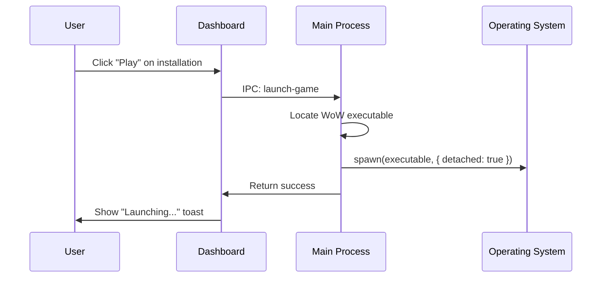

# Game Integration

Features that connect directly with WoW game installations.

---

## Purpose

Provide convenience features that enhance the addon management experience by integrating with the actual game.

---

## Features

### Play Time Tracking
- Track when each WoW installation was last played
- Display "Last played" timestamp on dashboard
- Calculated from game executable modification time or log files

### Direct Game Launch
- Launch WoW directly from the manager
- Spawn game process without blocking the manager
- Works with all supported WoW versions

### Installation Profiles
- Quick-switch between WoW versions
- Dashboard shows all installations at a glance
- Stats per installation (addon count, last played)

---

## Main Flow

---

## Components

| File | Role |
|------|------|
| `src/pages/Dashboard.tsx` | Installation cards, play buttons |
| `electron/main.ts` | `launch-game`, `get-last-played` handlers |
| `src/services/storage.ts` | Store installation metadata |

---

## Test Flows

### Positive Flows
- [ ] Launch WoW from dashboard
- [ ] Display correct "last played" time
- [ ] Show all installations on dashboard
- [ ] Update play time after game launch

### Negative Flows
- [ ] Handle missing game executable
- [ ] Handle already-running game
- [ ] Handle permission errors on launch

---

## Definition of Done

- [ ] Game launches without blocking manager
- [ ] Last played time updates correctly
- [ ] Dashboard shows accurate installation stats
- [ ] Launch errors show helpful messages
