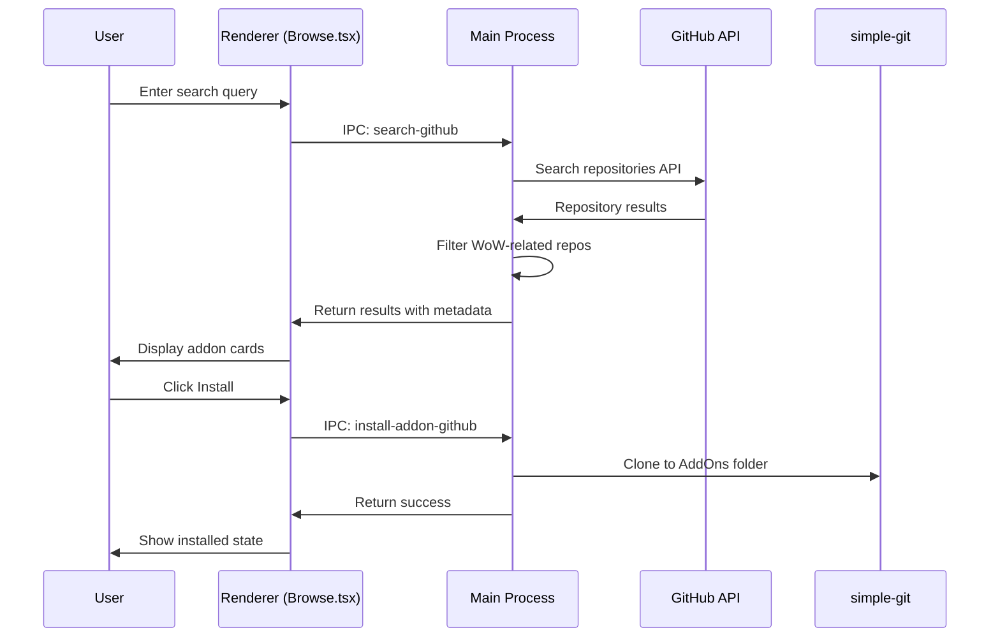

# GitHub Integration

Integration with GitHub for discovering, installing, and updating addons.

---

## Purpose

Allow users to install addons directly from GitHub repositories and keep them updated with git pull operations.

---

## Business Rules

1. GitHub URLs are parsed to extract owner/repo and optional branch
2. Cloning uses `simple-git` library in main process
3. Branch information is stored with addon metadata for switching
4. Profile avatars are fetched from GitHub API
5. Featured addons list is curated and displayed on launch

---

## Main Flow

---

## Features

### Repository Search
- Search GitHub for WoW addon repositories
- Filter by stars, recent updates
- Display owner avatar and repository metadata

### Smart URL Parsing
Supported formats:
- `https://github.com/owner/repo`
- `https://github.com/owner/repo/tree/branch`
- `owner/repo` (shorthand)
- `owner/repo@branch` (with branch)

### Branch Management
- Clone specific branch when specified
- Switch branches post-installation
- Pull updates from current branch

### TOC Version Detection
- Fetch `.toc` file from GitHub before install
- Parse `## Interface` to determine compatible WoW versions
- Warn user if interface version mismatches their installation

---

## Components

| File | Role |
|------|------|
| `electron/main.ts` | `search-github`, `install-addon-github`, `fetch-toc-from-github` handlers |
| `src/pages/Browse.tsx` | Search UI, addon cards, install buttons |
| `src/components/AvatarImage.tsx` | GitHub avatar display |

---

## Test Flows

### Positive Flows
- [ ] Search returns relevant WoW addon results
- [ ] Install from standard GitHub URL
- [ ] Install from URL with branch specifier
- [ ] Clone to correct AddOns directory
- [ ] Pull updates for Git-based addon

### Negative Flows
- [ ] Handle invalid GitHub URL format
- [ ] Handle non-existent repository
- [ ] Handle rate limiting from GitHub API
- [ ] Handle clone failure (network, permissions)

---

## Definition of Done

- [ ] Search returns results within 2 seconds
- [ ] All URL formats are correctly parsed
- [ ] Cloned addons have working Git metadata
- [ ] Avatar images display correctly
- [ ] Error messages are specific and helpful
