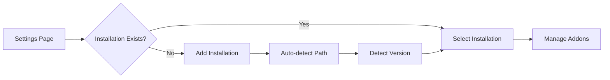

# WoW Version Support

Support for multiple World of Warcraft game versions.

---

## Purpose

Enable users to manage addons across all WoW versions from a single application.

---

## Supported Versions

| Version | Interface Range | Notes |
|---------|-----------------|-------|
| Vanilla (1.12) | 11200 | Classic Era |
| TBC (2.4.3) | 20400 | The Burning Crusade |
| WotLK (3.3.5) | 30300 | Wrath of the Lich King |
| Cataclysm (4.3.4) | 40300 | |
| MoP (5.4.8) | 50400 | Mists of Pandaria |
| Retail | 100000+ | Current live version |
| Classic SoD | 11500 | Season of Discovery |

---

## Business Rules

1. Each WoW installation is stored as a separate "installation" with its own addon list
2. The `## Interface` field in `.toc` determines addon compatibility
3. One addon can be compatible with multiple versions (multi-toc or range)
4. Installation paths are auto-detected or manually configured

---

## Main Flow



---

## Interface Version Mapping

The `mapInterfaceToVersion()` function in `electron/main.ts` handles:

```typescript
// Examples:
11200-11299  → Vanilla
20000-20499  → TBC
30000-30399  → WotLK
40000-40399  → Cataclysm
50000-50499  → MoP
100000+      → Retail
```

---

## Components

| File | Role |
|------|------|
| `src/pages/Settings.tsx` | Installation management UI |
| `src/types/installation.ts` | `Installation` interface |
| `electron/main.ts` | `mapInterfaceToVersion()`, installation handlers |
| `src/services/storage.ts` | Persist installations to localStorage |

---

## Test Flows

### Positive Flows
- [ ] Add new WoW installation manually
- [ ] Auto-detect WoW installation path
- [ ] Correctly identify WoW version from path
- [ ] Switch between multiple installations
- [ ] Show addons for selected installation only

### Negative Flows
- [ ] Reject invalid installation path
- [ ] Handle missing Interface/AddOns folder
- [ ] Handle unrecognized WoW version

---

## Definition of Done

- [ ] All listed WoW versions are recognized
- [ ] Version correctly parsed from interface number
- [ ] Installations persist across app restarts
- [ ] Switching installations is instant
- [ ] Invalid paths show clear error messages
