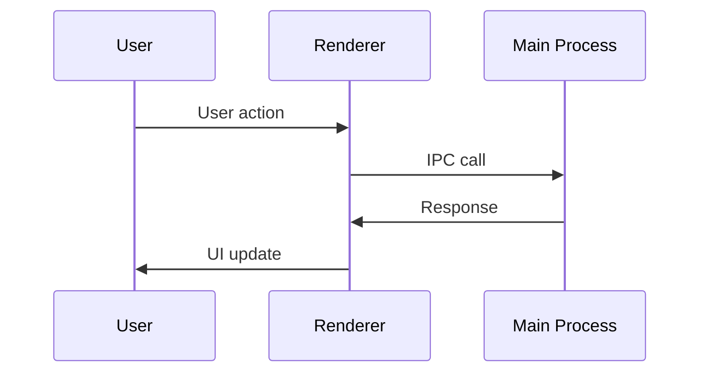

# Feature: [Feature Name]

Brief description of what this feature does.

---

## Purpose

Why this feature exists and what value it provides.

---

## Business Rules

1. Rule one
2. Rule two
3. Rule three

---

## Main Flow

---

## Edge Cases

| Scenario | Handling |
|----------|----------|
| Edge case 1 | How it's handled |
| Edge case 2 | How it's handled |

---

## Components

| File | Role |
|------|------|
| `path/to/file.ts` | Description |

---

## Test Flows

### Positive Flows
- [ ] Happy path 1
- [ ] Happy path 2

### Negative Flows
- [ ] Error case 1
- [ ] Error case 2

---

## Definition of Done

- [ ] Criterion 1
- [ ] Criterion 2
- [ ] Criterion 3
